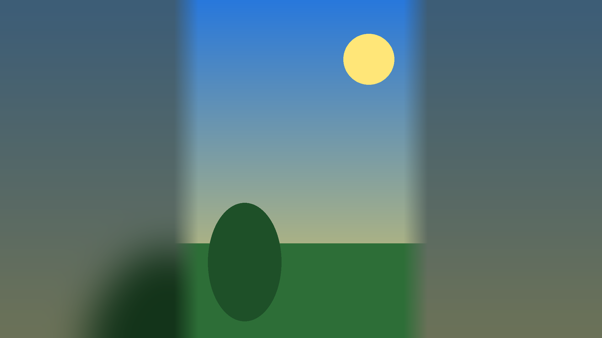

# Gaussify

**Make any image a full-screen wallpaper — no black bars.**

When you run a Windows wallpaper slideshow in **Fit** mode, images that don't
match your monitor's aspect ratio get ugly black bars in the empty gutters
(left/right for narrow images, top/bottom for short ones).

Gaussify fixes this. It batch-processes a folder of images so each one fills the
screen: the original stays **crisp and centered**, and the empty gutters are
filled with a **blurred, zoomed copy of the same image** that fades smoothly out
from the sharp center. A **side-darkening** slider tones those blurred edges down
for a classy look. This is the "blurred background fill" effect phones use for
mismatched wallpapers.



---

## Requirements

- **Python 3.9+** (tested on 3.14)
- **[Pillow](https://python-pillow.org/)** — the only dependency
  (Tkinter, the GUI toolkit, already ships with Python)

## Install

```powershell
# 1. Clone the repo
git clone https://github.com/<your-username>/gaussify.git
cd gaussify

# 2. Install the one dependency
pip install -r requirements.txt
```

## Run

```powershell
python gaussify.py
```

That opens the GUI. To confirm the effect works without opening the window:

```powershell
python gaussify.py --selftest
```

---

## How to use it

1. **Load your images.** Click **Add Images…** to pick files, or **Add Folder…**
   to load an entire folder at once. They appear in the list on the left.
2. **Preview.** Click any image in the list. The right-hand panel shows the
   *final* result live — it re-renders instantly as you change settings.
3. **Set your resolution.** Pick a preset (1080p / 1440p / 4K) from the dropdown,
   type a custom width/height, or click **Use my screen** to match your monitor.
4. **Tune the effect.** Settings are organized into three tabs (the preview
   updates live as you drag):

   **Basics**
   | Control | What it does |
   | --- | --- |
   | **Blur strength** | How soft the filled gutters are (Gaussian blur radius). |
   | **Side darkening** | How much to dim the backdrop — the "classy tone". |
   | **Feather / fade** | How far the crisp center melts into the fill (softens the seam). |

   **Background**
   | Control | What it does |
   | --- | --- |
   | **Fill style** | *Blur* (zoomed blurred copy), *Solid color* (auto-picked from the image, or your own), or *Mirrored* (gutters reflect the image edges). |
   | **Background zoom** | How zoomed-in the blurred backdrop is (more zoom = more abstract). |
   | **Saturation** | Wash out or boost the backdrop's colors. |
   | **Tint color + strength** | Blend a color over the backdrop (e.g. a cool navy tone). |
   | **Vignette** | Darken the corners/edges of the final wallpaper. |

   **Foreground**
   | Control | What it does |
   | --- | --- |
   | **Position** | Center, or dock the crisp image left/right/top/bottom — or **random**, which docks each image to a random left/right side with the fill covering the rest. |
   | **Image scale** | Shrink the crisp image below 100 % for a floating-card look. |
   | **Drop shadow** | Soft shadow behind the crisp image. |
   | **Corner radius** | Rounded corners on the crisp image. |

5. **Or just pick a preset.** The **Preset** dropdown ships with **Subtle**,
   **Classy**, and **Dramatic**. Dial in your own look and hit **Save preset…**
   to keep it; all settings are also remembered automatically between sessions
   (stored in `gaussify_config.json` next to the script).
6. **Choose output.** Click **Output Folder…**, pick where results should go, and
   select **PNG** (lossless) or **JPG** (smaller files).
7. **Click "Process All."** Every loaded image is rendered at your target
   resolution and written to the output folder. A progress bar tracks it.

> By default, images that already match your screen are copied through untouched
> (no blur). Tick **"Also process already-matching images"** to force the effect
> on everything.

### Set it as your Windows slideshow

1. Open **Settings → Personalization → Background**.
2. Set **Personalize your background** to **Slideshow**.
3. **Browse** and select your Gaussify **output folder**.
4. Set **Choose a fit for your desktop image** to **Fit**.

No more black bars. 🎉

---

## How it works

For each image, at your target `W × H`:

1. **Fill needed?** If the fitted image leaves gutters wider than a small
   tolerance, it gets the blurred fill; otherwise it's placed as-is.
2. **Background** — built in the chosen fill style (blurred cover-scaled copy,
   solid color, or mirrored edges), then saturation / darkening / tint applied.
3. **Foreground** — the image is scaled to *fit* (letterbox), optionally shrunk
   and docked to a side, with an optional drop shadow and rounded corners.
4. **Feathered seam** — only the gutter-facing edges of the crisp image fade
   into the fill via an alpha gradient, so there's no hard line.
5. The two are composited, a vignette is optionally applied, and the result is
   saved at exactly `W × H`.

Handles both orientations (narrow images → left/right fill; short images →
top/bottom fill). All the image logic lives in `gaussify.py` under `render()` and
is importable independently of the GUI. Your original files are never overwritten.

---

## Build a standalone `.exe` (optional)

Want to run it without Python installed? Package it with PyInstaller:

```powershell
pip install pyinstaller
pyinstaller --onefile --windowed --name Gaussify gaussify.py
```

The double-clickable executable lands in `dist\Gaussify.exe`.

---

## License

MIT — do whatever you like.
